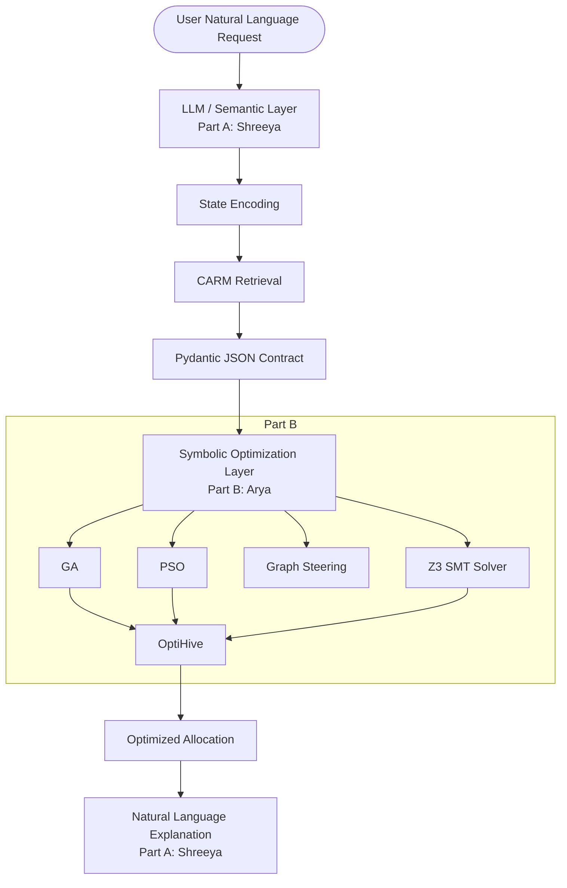
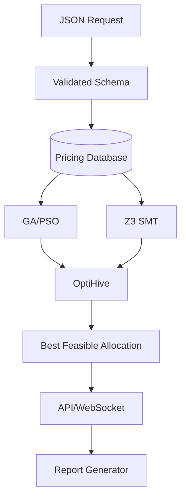

# FinOps Neuro-Symbolic Orchestrator

Neuro-Symbolic AI system for intelligent Cloud FinOps optimization using LLMs, metaheuristics, and SMT solvers.

## Overview

Cloud FinOps requires finding the optimal allocation of cloud resources across multiple providers to meet performance requirements while minimizing cost. This is a complex combinatorial optimization problem. Natural-language input alone is insufficient because LLMs struggle with deterministic mathematical guarantees. Therefore, this project uses a neuro-symbolic architecture to separate probabilistic natural-language understanding from deterministic mathematical optimization.

## Core Idea

The project is divided into two distinct layers:

**Neural/Semantic Layer (Part A - Shreeya):**
- Natural-language understanding
- Constraint extraction
- Semantic retrieval (CARM)
- Validated JSON generation

**Symbolic Layer (Part B - Arya):**
- Optimization
- Formal constraints
- Metaheuristics (GA / PSO)
- SMT solving (Z3)
- Candidate validation/selection (OptiHive)

## System Architecture



## Pipeline

1. **Stage 1 — State Encoding:** Extracting features from user query (Shreeya).
2. **Stage 2 — CARM Template Match:** Retrieving historical context (Shreeya).
3. **Stage 3 — Pydantic JSON Contract:** Validating the structured handshake (Shreeya).
4. **Stage 4 — Parallel GA/PSO Race:** Metaheuristic optimization (Arya).
5. **Stage 5 — OptiHive / Symbolic Validation:** Validating and selecting the best solver output (Arya).
6. **Stage 6 — Natural Language Report:** Explaining the final allocation (Shreeya).

## Arya's Responsibilities

As the Symbolic Metaheuristics, SMT Solvers & Validation Engineer (Part B), Arya is responsible for:

### SYM-1 — Vectorized GA/PSO Engine
Parallel/pre-compiled optimization algorithms using NumPy/SciPy.
- GA for discrete cloud VM/resource choices.
- PSO for continuous optimization parameters (e.g., bandwidth).
- A competitive "virtual math race" coordinates and compares them.

### SYM-2 — Graph-Steered Z3 SMT Solver
A Z3 SMT solver guided by graph-based predictions (SAGE-GNN).
Enforces hard constraints (budget, vCPUs, RAM) strictly, while utilizing soft constraints as placement preferences without overriding hard limits.

### SYM-3 — OptiHive Latent Selection
A two-stage solver/solution selection mechanism:
1. ILP-based syntactic/validity filtering.
2. Latent-Class Expectation-Maximization (EM) based quality scoring/selection under noisy data.

### SYM-4 — FastAPI/WebSocket Gateway
An asynchronous FastAPI backend exposing the optimization engine, with real-time convergence streaming via WebSockets.

### SYM-5 — Pricing & Benchmark Database
A local SQLite database storing cloud pricing and resource data (AWS, Azure, GCP) and benchmark cases to supply candidate configurations to algorithms.

### SYM-6 — Literature Survey
Researching related symbolic papers (OptiHive, SAGE-GNN, AutoCO, HeurAgenix, TSP LLM Heuristics).

## Interface Contract

Integration between Part A and Part B relies entirely on a shared Pydantic contract.

```python
class FinOpsRequest(BaseModel):
    problem_type: str = "cloud_finops_allocation"
    budget_max_usd: float
    latency_max_ms: float
    required_vcpus: int
    required_ram_gb: float
    sla_availability: float
    cloud_providers: List[str]
```

**JSON Example:**
```json
{
    "problem_type": "cloud_finops_allocation",
    "budget_max_usd": 500.0,
    "latency_max_ms": 100.0,
    "required_vcpus": 8,
    "required_ram_gb": 16.0,
    "sla_availability": 99.9,
    "cloud_providers": [
        "AWS",
        "Azure",
        "GCP"
    ]
}
```
Arya's implementation is entirely independent of the LLM logic and consumes this mock JSON for independent development.

## Repository Structure

```text
finops-neuro-symbolic-orchestrator/
├── README.md
├── requirements.txt
├── .gitignore
├── api/             # SYM-4 FastAPI & WebSocket Gateway
├── benchmarks/      # Benchmark running tools
├── data/            # Local Pricing & Benchmark files (Sample data)
├── database/        # SYM-5 Pricing Database logic
├── docs/            # Architecture and Literature Review
├── optimizers/      # SYM-1 GA / PSO Engine
├── optihive/        # SYM-3 Latent Selection Core
├── schemas/         # Shared Pydantic handshake contract
├── solvers/         # SYM-2 Graph-Steered Z3 Solver
└── tests/           # Unit tests
```

## Data Flow



## Technologies
- Python
- NumPy, SciPy
- Pydantic
- FastAPI, WebSockets
- Z3 Solver
- SQLAlchemy (SQLite)

## Installation

1. Clone repository
```bash
git clone https://github.com/your-username/finops-neuro-symbolic-orchestrator.git
cd finops-neuro-symbolic-orchestrator
```
2. Create virtual environment
```bash
python -m venv venv
```
3. Activate environment (Windows)
```bash
venv\Scripts\activate
```
4. Install requirements
```bash
pip install -r requirements.txt
```
5. Run tests
```bash
pytest tests/
```
6. Start FastAPI server
```bash
uvicorn api.main:app --reload
```

## Running the Project (Planned)
- Validating a request: Pass a JSON payload to the `/optimize` endpoint.
- Optimization: The API routes valid payloads to the `OptimizerRace` and `Z3Solver`.
- WebSocket: Connect to `ws://localhost:8000/ws/optimize-stream` for convergence updates.
*(Note: Full optimization execution is currently planned/TODO).*

## Development Roadmap
- **Phase 1:** Project scaffolding + schemas (Current)
- **Phase 2:** GA/PSO
- **Phase 3:** Z3
- **Phase 4:** Graph steering
- **Phase 5:** OptiHive
- **Phase 6:** Database and benchmarks
- **Phase 7:** FastAPI/WebSocket
- **Phase 8:** Shreeya integration
- **Phase 9:** Evaluation

## Evaluation Metrics (TARGETS)
- **GA/PSO:** Target sub-millisecond execution.
- **Z3:** Target search-tree speedup and 100% hard-constraint compliance.
- **OptiHive:** Target >95% optimal solver selection under noisy data.
- **API:** Target <50 ms endpoint latency.
- **Database/benchmark:** Ensure physical feasibility.

*(These are target metrics as per project specification. They have not yet been achieved.)*

## Testing
- `test_ga.py`: Verifies GA accepts valid input and outputs expected structure.
- `test_pso.py`: Verifies PSO accepts valid input and outputs expected structure.
- `test_z3.py`: Verifies Z3 initializes and accepts valid input constraints.
- `test_api.py`: Tests FastAPI application loading and endpoint validation.

## Integration with Shreeya
Arya's symbolic modules do not depend on any specific LLM provider, prompt, or Shreeya's internal implementation. 
The system flow relies strictly on:
`Shreeya -> Pydantic JSON -> Arya symbolic engine`
Arya develops and tests independently using mock JSON conforming to the contract.

## Academic Context
Semester V Artificial Intelligence course project. Architecture based on provided work-allocation specification.

## Research References
Planned literature review topics for Part B:
- OptiHive
- SAGE-GNN
- AutoCO
- HeurAgenix
- TSP LLM Heuristics

## Current Status
- [x] Repository scaffolding
- [x] Pydantic contract
- [ ] GA
- [ ] PSO
- [ ] GA/PSO race
- [ ] Z3 solver
- [ ] Graph steering
- [ ] OptiHive ILP filter
- [ ] EM selector
- [ ] Pricing database
- [ ] Benchmarks
- [x] FastAPI skeleton
- [ ] WebSocket
- [ ] Integration with Shreeya
- [ ] Final evaluation
