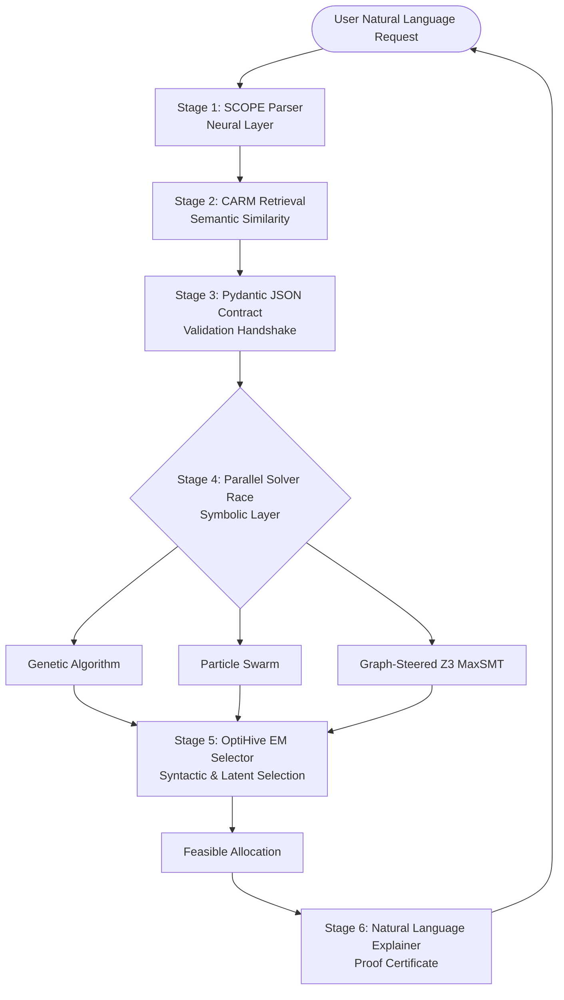

# FinOps Neuro-Symbolic Orchestrator (Neurasym)

**A 6-stage neuro-symbolic pipeline combining Large Language Models (LLMs) and Metaheuristics/SMT Solvers for optimal cloud FinOps resource allocation.**

## 1. Project Overview

Cloud FinOps requires finding the optimal allocation of cloud resources across multiple providers to meet performance requirements while minimizing cost. This is a complex combinatorial optimization problem. Natural-language input alone is insufficient because LLMs struggle with deterministic mathematical guarantees. 

**Neurasym** solves this by implementing a neuro-symbolic architecture that strictly separates probabilistic natural-language understanding (the Semantic Layer) from deterministic mathematical optimization (the Symbolic Layer) through a validated JSON contract handshake.

## 2. Project Status

**Verified Implementation Status:**
- ✅ **Semantic Layer**: Natural language extraction (SCOPE), Historical CARM matching.
- ✅ **Symbolic Layer**: GA, PSO, Graph-steered Z3 MaxSMT, and OptiHive Selection.
- ✅ **CLI & Orchestration**: 6-stage terminal visualization, 4-Way benchmark mode, and SAGE-GNN graph evaluation.
- ✅ **API**: FastAPI endpoints.
- 🚧 **Testing**: Comprehensive test suite available via `pytest`, though local execution requires valid OpenAI API keys and specific data science dependencies.

## 3. Table of Contents
1. [Problem Statement](#4-problem-statement)
2. [Motivation and Design Philosophy](#5-motivation-and-design-philosophy)
3. [Key Features](#6-key-features)
4. [System Architecture](#7-system-architecture)
5. [Complete Execution Workflow](#8-complete-execution-workflow)
6. [Neural and Symbolic Components](#9-neural-and-symbolic-components)
7. [Repository Structure](#10-repository-structure)
8. [Technology Stack](#11-technology-stack)
9. [Prerequisites](#12-prerequisites)
10. [Installation and Setup](#13-installation-and-setup)
11. [Configuration](#14-configuration-and-environment-variables)
12. [How to Run](#15-how-to-run-the-project)
13. [Input and Output Format](#16-input-and-output-format)
14. [API Usage](#17-api-or-programmatic-usage)
15. [Testing and Validation](#18-testing-and-validation)
16. [Benchmarks and Evaluation](#19-benchmarks-and-evaluation)
17. [Design Decisions](#20-design-decisions-and-trade-offs)
18. [Limitations](#21-limitations)
19. [Roadmap](#22-roadmap-and-future-work)
20. [Contributing](#23-contributing)
21. [Security](#24-security-and-responsible-configuration)
22. [License](#25-license)

## 4. Problem Statement
Translating unstructured enterprise FinOps intents (e.g., *"Deploy an 8 vCPU web app under $300 on AWS with 99.9% SLA"*) directly into physical cloud topology deployments is risky. Pure LLM approaches hallucinate constraints, fail basic arithmetic, and violate hard budget limits. Pure symbolic solvers require exact mathematical formulas that business users cannot provide. This project bridges that gap.

## 5. Motivation and Design Philosophy
By combining Neural networks (LLMs) and Symbolic logic (SMT/Metaheuristics), we exploit the strengths of both paradigms. The LLM acts purely as a semantic translator and explainer, converting English into a strict JSON schema. The Symbolic layer acts as the math engine, guaranteeing that budget constraints and resource requirements are strictly met without hallucination.

## 6. Key Features
- **SCOPE Parsing:** Extracts constraints from natural language.
- **CARM Templates:** Matches requests against historical optimal templates via cosine similarity.
- **Pydantic Handshake:** Validates inputs before math operations begin.
- **Parallel Solver Race:** Runs Genetic Algorithms (discrete), Particle Swarm (continuous), and Z3 SMT (formal) concurrently.
- **OptiHive Selector:** Uses Latent-Class Expectation-Maximization to pick the most mathematically sound solver output.
- **Diagnostics Modes:** Native support for 4-way LLM-vs-Neurasym comparative benchmarks.

## 7. System Architecture


```mermaid
flowchart TD
    User([User Natural Language Request]) --> SCOPE[Stage 1: SCOPE Parser<br>Neural Layer]
    SCOPE --> CARM[Stage 2: CARM Retrieval<br>Semantic Similarity]
    CARM --> Contract[Stage 3: Pydantic JSON Contract<br>Validation Handshake]
    Contract --> Race{Stage 4: Parallel Solver Race<br>Symbolic Layer}
    
    Race --> GA[Genetic Algorithm]
    Race --> PSO[Particle Swarm]
    Race --> Z3[Graph-Steered Z3 MaxSMT]
    
    GA --> OptiHive[Stage 5: OptiHive EM Selector<br>Syntactic & Latent Selection]
    PSO --> OptiHive
    Z3 --> OptiHive
    
    OptiHive --> Best[Feasible Allocation]
    Best --> NL[Stage 6: Natural Language Explainer<br>Proof Certificate]
    NL --> User
```

## 8. Complete Execution Workflow
1. **Stage 1 (State Encoding):** User provides unstructured text. The `SCOPEParser` invokes an LLM to extract vCPUs, RAM, Budget, and Provider.
2. **Stage 2 (CARM Match):** Compares the parsed state against historical templates.
3. **Stage 3 (Validation):** Forces data through `CloudOptimizationContract` (Pydantic). If invalid, it halts.
4. **Stage 4 (Solver Race):** Translates the contract to symbolic variables and runs `GeneticAlgorithm`, `ParticleSwarmOptimization`, and `GraphSteeredZ3Solver`.
5. **Stage 5 (OptiHive):** The `OptiHiveSelector` scores the three candidate outputs based on constraint violations and objective cost, selecting the winner.
6. **Stage 6 (Report):** The `FinOpsExplainer` translates the physical VM allocation back into natural language.

## 9. Neural and Symbolic Components
- **Neural:** Utilizes the `openai` Python client to perform entity extraction and final natural language summarization. It is deliberately isolated from mathematical allocation.
- **Symbolic:** Uses `scipy`/`numpy` for metaheuristics and `z3-solver` for formal SMT proofs. The Z3 solver relies on an `InfrastructureGraph` to map cloud topological constraints before solving.

## 10. Repository Structure
```text
neuro-symbolic-orchestrator/
├── benchmarks/         # 4-way evaluation & final benchmarking scripts
├── config/             # Project configurations
├── data/               # Seed databases (cloud pricing)
├── src/                
│   ├── api/            # FastAPI app and websocket routing
│   ├── orchestrator/   # Main NeuroSymbolicOrchestrator coordination
│   ├── schemas/        # Pydantic contract (CloudOptimizationContract)
│   ├── semantic/       # SCOPE parsing, CARM matcher, NL explainer
│   └── symbolic/       # GA, PSO, Z3, and OptiHive implementations
├── templates/          # CARM historical templates
├── tests/              # Pytest suite
├── main.py             # CLI Entrypoint for diagnostics and queries
├── run_stages.py       # 6-Stage terminal visualization runner
└── requirements.txt    # Project dependencies
```

## 11. Technology Stack
- **Language:** Python 3.9+
- **Neural/Parsing:** `openai`
- **Validation:** `pydantic`
- **Optimization:** `numpy`, `scipy`, `z3-solver`
- **API & Web:** `fastapi`, `uvicorn`, `websockets`, `streamlit`
- **Testing:** `pytest`

## 12. Prerequisites
- Python 3.9 or higher.
- An OpenAI API key (for semantic parsing).
- Standard build tools for installing `z3-solver` and `scipy`.

## 13. Installation and Setup
1. **Clone the repository:**
   ```bash
   git clone https://github.com/Aryasurya12/neuro-symbolic-orchestrator.git
   cd neuro-symbolic-orchestrator
   ```
2. **Create and activate a virtual environment:**
   ```bash
   python -m venv venv
   # On Windows:
   venv\Scripts\activate
   # On macOS/Linux:
   source venv/bin/activate
   ```
3. **Install dependencies:**
   ```bash
   pip install -r requirements.txt
   ```
4. **Configure environment:**
   Copy the example environment file and add your credentials.
   ```bash
   cp .env.example .env
   ```

## 14. Configuration and Environment Variables
Configuration is managed via the `.env` file.

| Variable Name | Purpose | Required | Example |
|---|---|---|---|
| `OPENAI_API_KEY` | Used by the Semantic layer for extraction. | Yes | `sk-...` |

*Note: Never commit your real `.env` file containing API keys.*

## 15. How to Run the Project

**1. 6-Stage Interactive Visualizer:**
Traces a query through the exact 6-stage neuro-symbolic pipeline, printing the latencies and states of each stage.
```bash
python run_stages.py "Deploy a high compute workload with 8 vCPUs and 16GB RAM in AWS for under $300 a month with 99.9% SLA."
```

**2. Interactive CLI Mode (Orchestrator):**
```bash
python main.py
```

**3. SAGE-GNN Graph Benchmark:**
Evaluates the graph-steered Z3 solver against multiple topologies.
```bash
python main.py --sage-gnn
```

**4. 4-Way Comparative Benchmark:**
Evaluates the orchestrator against pure-LLM baseline approaches.
```bash
python main.py --benchmark
```

## 16. Input and Output Format
**Input (Natural Language):**
> *"I need an AWS instance with 8 vCPUs and 16GB RAM for less than $300 a month."*

**Intermediate Validated Contract (JSON):**
```json
{
  "problem_type": "cloud_finops_allocation",
  "budget_max_usd": 300.0,
  "required_vcpus": 8,
  "required_ram_gb": 16.0,
  "cloud_providers": ["AWS"],
  "sla_availability_pct": 99.9
}
```

**Output:**
Provides a strict mathematical guarantee of which exact Instance Type (e.g., `t3.2xlarge`) is selected, alongside an English justification and cost breakdown.

## 17. API or Programmatic Usage
The backend is exposed via a FastAPI application in `src/api/app.py`.
To start the API server locally:
```bash
uvicorn src.api.app:app --reload
```
You can then programmatically invoke the orchestrator via HTTP endpoints defined in `src/api/routes.py`.

## 18. Testing and Validation
The project uses `pytest`. 
```bash
python -m pytest tests/
```
*Note during audit: The test suite includes 40+ module tests. Running tests requires the environment to have valid OpenAI keys and plotting libraries (`plotly`) installed as defined in `requirements.txt`. Without these, tests will raise `ModuleNotFoundError` or API exceptions.*

## 19. Benchmarks and Evaluation
The `main.py` entrypoint natively supports benchmarking:
- **`FourWayBenchmarker`:** Compares the Neuro-Symbolic approach against naive LLM outputs.
- **SAGE-GNN Benchmark:** Evaluates Z3 MaxSMT graph placement runtime and constraint satisfaction (feasibility percentages and ms latencies).

## 20. Design Decisions and Trade-offs
- **Parallel Solver Race vs Single Solver:** Z3 guarantees optimality but scales poorly (NP-Hard). GA/PSO scale well but don't guarantee optimality. Running them in parallel allows OptiHive to pick the best available result within the latency SLA.
- **Strict Separation of Concerns:** LLMs are explicitly blocked from executing math. They only format JSON. This completely eliminates "math hallucinations" during financial provisioning.

## 21. Limitations
- **API Dependency:** Stage 1 and Stage 6 require an active internet connection to OpenAI.
- **Solver Cold Starts:** Z3 constraint modeling adds overhead, sometimes delaying response times beyond interactive UI thresholds for highly complex cross-region topological queries.
- **Data Freshness:** Currently relies on static seeded local databases for cloud pricing rather than live AWS/GCP/Azure pricing APIs.

## 22. Roadmap and Future Work
- Connect pricing database to live cloud provider APIs.
- Enhance the OptiHive latent-class EM model with historical telemetry feedback.
- Expand WebSockets to stream solver convergence metrics to the frontend in real-time.

## 23. Contributing
1. Fork the repository.
2. Create a feature branch (`git checkout -b feature/improvement`).
3. Ensure all tests pass (`python -m pytest tests/`).
4. Submit a Pull Request describing your changes.

## 24. Security and Responsible Configuration
- Do not commit your `.env` file.
- The system runs Python `eval()` internally inside solver domains; never expose the symbolic logic directly to untrusted unvalidated JSON. The Pydantic layer (Stage 3) acts as the primary security sanitizer.

## 25. License
No explicit license file (`LICENSE`) is present in the repository.

---
*This README was generated by auditing the actual `main` branch implementation of the Neuro-Symbolic Orchestrator.*
