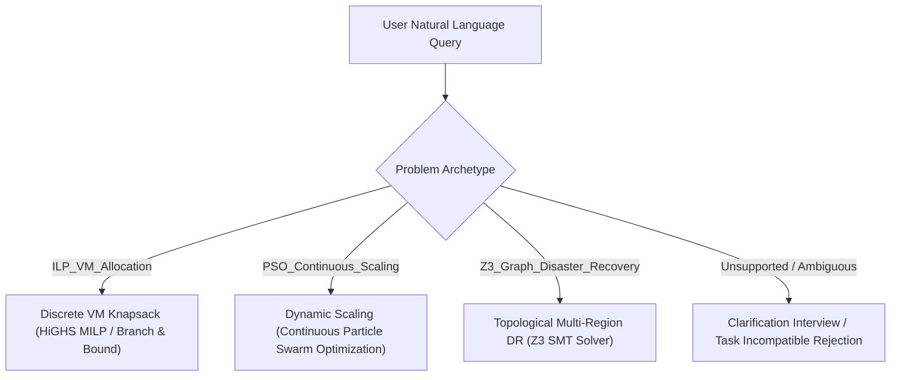

# Neurasym Ground-Truth Reference Package & Task Boundary Specification

> **Purpose**: This document provides the complete, authoritative specification of all supported problem archetypes, synthetic catalog bounds, regional network topologies, pricing models, mathematical formulas, and clarification policies implemented in the Neurasym optimization system.
> **Intended Use**: Reference documentation for formulating and labeling benchmark query datasets.

---

## 1. Problem Archetypes & Mathematical Domains

Neurasym supports three distinct, non-overlapping infrastructure optimization archetypes:

---

## 2. Archetype 1: Discrete VM Knapsack Allocation (`ILP_VM_Allocation`)

### 2.1 Problem Formulation
Select an integer combination of virtual machine instances from the ground-truth catalog to satisfy minimum aggregate compute (vCPUs) and memory (RAM in GB) requirements at minimum total monthly cost, without exceeding the declared budget.

$$\min \sum_{i \in \text{SKUs}} x_i \cdot (\text{hourly\_price}_i \times 730)$$
$$\text{subject to:}$$
$$\sum_{i \in \text{SKUs}} x_i \cdot \text{vcpus}_i \ge \text{required\_vcpus}$$
$$\sum_{i \in \text{SKUs}} x_i \cdot \text{ram\_gb}_i \ge \text{required\_ram\_gb}$$
$$\sum_{i \in \text{SKUs}} x_i \cdot (\text{hourly\_price}_i \times 730) \le \text{budget\_max\_usd}$$
$$x_i \in \mathbb{Z}_{\ge 0} \quad \forall i \in \text{SKUs}$$

### 2.2 Standard Ground-Truth VM SKU Catalog

| SKU Name | Provider | vCPUs | RAM (GB) | Hourly Price (USD) | Monthly Cost (USD, 730 hrs) |
| :--- | :--- | :--- | :--- | :--- | :--- |
| `t3.medium` | AWS | 2 | 4.0 | \$0.0416 | \$30.368 |
| `t3.large` | AWS | 2 | 8.0 | \$0.0832 | \$60.736 |
| `t3.xlarge` | AWS | 4 | 16.0 | \$0.1664 | \$121.472 |
| `c5.large` | AWS | 2 | 4.0 | \$0.0850 | \$62.050 |
| `c5.xlarge` | AWS | 4 | 8.0 | \$0.1700 | \$124.100 |
| `m5.large` | AWS | 2 | 8.0 | \$0.0960 | \$70.080 |
| `m5.xlarge` | AWS | 4 | 16.0 | \$0.1920 | \$140.160 |
| `m5.2xlarge` | AWS | 8 | 32.0 | \$0.3840 | \$280.320 |
| `Standard_D4s_v5` | Azure | 4 | 16.0 | \$0.1920 | \$140.160 |
| `e2-standard-4` | GCP | 4 | 16.0 | \$0.1340 | \$97.820 |

---

## 3. Archetype 2: Dynamic Continuous Scaling (`PSO_Continuous_Scaling`)

### 3.1 Problem Formulation & Capacity Model
Determine the optimal provisioned bandwidth $B \in [100, 1000]\text{ Mbps}$ and integer deployable replicas $R \in [1, 16]$ to support offered workload demand while keeping modeled CPU utilization below physical saturation ($100\%$) and below any user-specified maximum CPU ceiling.

$$\text{Modeled CPU Utilization } U = \left(\frac{B}{R \times C_{\text{rep}}}\right) \times 100\%$$
$$\text{Where } C_{\text{rep}} = 75.0\text{ Mbps per replica (synthetic capacity model)}$$

### 3.2 Dynamic Pricing Equation
$$\text{Monthly Cost (USD)} = (B \times \$0.08) + (R \times \$45.00)$$

### 3.3 Constraints & Bounds
1. **Workload Invariant**: $B \ge B_{\text{offered}}$ (The optimizer cannot shrink bandwidth below offered demand).
2. **Physical Ceiling**: $U \le 100.0\%$ (Overload violation if exceeded).
3. **Explicit Maximum Ceiling**: $U \le \text{max\_cpu\_pct}$ if explicitly specified by user (e.g. 60%).
4. **Deployable Integers**: $R \in \{1, 2, \dots, 16\}$.
5. **Operational Range**: $B \in [100.0, 1000.0]\text{ Mbps}$.
6. **Budget Limit**: $\text{Cost} \le \text{budget\_max\_usd}$.

---

## 4. Archetype 3: Multi-Region Disaster Recovery (`Z3_Graph_Disaster_Recovery`)

### 4.1 Problem Formulation & Topology
Select a pair of distinct primary and secondary regions $(R_A, R_B)$ from the regional infrastructure graph to minimize monthly synchronization cost while satisfying cross-region latency and composite availability SLA constraints.

### 4.2 Regional Infrastructure Topology Graph

| Region ID | Provider | Geographic Zone | Base Cost (USD/mo) | Single-Region SLA (%) | Peer Latencies (ms) |
| :--- | :--- | :--- | :--- | :--- | :--- |
| `us-east-1` | AWS | US_East | \$120.00 | 99.95% | `us-west-2`: 65ms, `eu-west-1`: 85ms, `eastus`: 12ms, `us-central1`: 32ms |
| `us-west-2` | AWS | US_West | \$130.00 | 99.95% | `us-east-1`: 65ms, `eu-west-1`: 135ms, `eastus`: 70ms, `us-central1`: 42ms |
| `eu-west-1` | AWS | Europe | \$140.00 | 99.95% | `us-east-1`: 85ms, `us-west-2`: 135ms, `eastus`: 90ms, `us-central1`: 105ms |
| `eastus` | Azure | US_East | \$125.00 | 99.95% | `us-east-1`: 12ms, `us-west-2`: 70ms, `eu-west-1`: 90ms, `us-central1`: 28ms |
| `us-central1` | GCP | US_Central | \$115.00 | 99.95% | `us-east-1`: 32ms, `us-west-2`: 42ms, `eu-west-1`: 105ms, `eastus`: 28ms |

### 4.3 DR Mathematics & Cost Function
- **Composite Availability SLA**:
  $$\text{Composite SLA} = \left(1 - \left(1 - \frac{\text{SLA}_A}{100}\right) \times \left(1 - \frac{\text{SLA}_B}{100}\right)\right) \times 100\%$$
  *(Two independent 99.95% regions produce $1 - (0.0005 \times 0.0005) = 99.999975\%$)*
- **Monthly Cost**:
  $$\text{Monthly Cost (USD)} = \text{BaseCost}(R_A) + \text{BaseCost}(R_B) + (\text{Latency}(R_A, R_B) \times \$0.25/\text{ms})$$
- **Failure Domain Disjointness**:
  $$R_A \ne R_B \quad \text{and} \quad \neg(\text{Geo}(R_A) = \text{Geo}(R_B) \land \text{Provider}(R_A) = \text{Provider}(R_B))$$

---

## 5. Supported Contract Fields (`CloudOptimizationContract`)

| Field Name | Type | Allowed Values / Range | Default | Purpose |
| :--- | :--- | :--- | :--- | :--- |
| `problem_type` | `str` | `ILP_VM_Allocation`, `PSO_Continuous_Scaling`, `Z3_Graph_Disaster_Recovery` | Required | Dispatched problem archetype |
| `budget_max_usd` | `float` | $\ge \$10.00$ | \$500.00 | Hard monthly financial ceiling |
| `cloud_providers` | `List[str]` | `AWS`, `Azure`, `GCP` | `["AWS"]` | Allowed infrastructure providers |
| `required_vcpus` | `int` | $\ge 1$ | 1 | Minimum total vCPU count |
| `required_ram_gb` | `float` | $\ge 1.0$ | 1.0 | Minimum total RAM in GB |
| `target_bandwidth_mbps` | `float` | $100.0 \dots 1000.0$ | 100.0 | Offered traffic demand |
| `target_cpu_pct` | `float` | $10.0 \dots 100.0$ | 70.0% | Target operational CPU setpoint |
| `max_cpu_pct` | `Optional[float]` | $10.0 \dots 100.0$ | `None` (100% physical) | Hard ceiling limit on CPU |
| `latency_max_ms` | `float` | $1.0 \dots 1000.0$ | 100.0 ms | Maximum cross-region latency |
| `sla_availability_pct` | `float` | $90.0 \dots 99.999$ | 99.9% | Minimum composite availability |

---

## 6. Default & Clarification Policy

1. **Clarification Protocol**:
   - Queries with missing essential parameters (such as an ambiguous query asking to "optimize cloud" with no workload metrics) must emit `CLARIFICATION_REQUIRED`.
   - Guessed or ungrounded allocations are considered reasoning failures for ambiguous queries.
2. **Unsupported Tasks**:
   - Out-of-domain requests (quantum computing, database SQL optimization, DNS records, image generation, chitchat) must emit `TASK_INCOMPATIBLE` / `UNSUPPORTED`.
3. **Infeasible Demands**:
   - Mathematically conflicting constraints (e.g. 64 vCPUs for \$10/mo, or cross-continental DR with 5ms latency) must report `SOLVER_INFEASIBLE` / `INFEASIBLE`.
