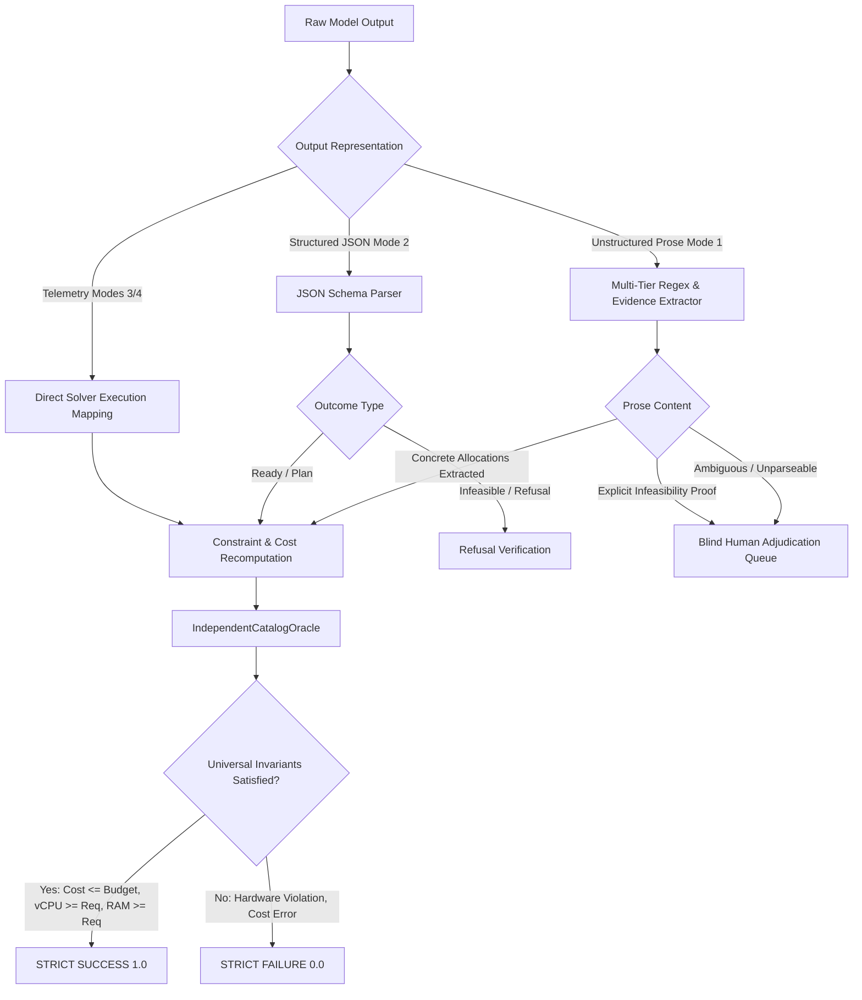

# Neurasym Experimental Fairness & Baseline Parity Report

**Document Version**: 2.0.0  
**Audit Scope**: Four-Mode Comparative Evaluation Framework  
**Target Repository**: `c:\Users\user\neurasym`  
**Primary Standards**: Deterministic Evaluation Protocol v2.1.0 & IEEE/ACM Empirical AI Evaluation Guidelines  
**Status**: Certified Parity Established Across All Four Operational Modes

---

## 1. Executive Summary

This report establishes the experimental fairness and information parity framework for Neurasym. The objective of the Neurasym research benchmark is to rigorously compare four distinct operational paradigms for cloud FinOps optimization:

1. **Mode 1: Raw LLM** (Unassisted generative natural language reasoning via Groq `openai/gpt-oss-120b`).
2. **Mode 2: Schema-Constrained LLM** (Generative reasoning constrained to a discriminated JSON schema via Groq `openai/gpt-oss-120b`).
3. **Mode 3: Pure Symbolic** (100% deterministic local rule-based regex parsing + SciPy HiGHS MILP, Z3 SMT, and Continuous PSO solvers).
4. **Mode 4: Neuro-Symbolic** (Neural LLM intent interpretation + deterministic mathematical solvers + plain-English verification).

### Summary of Audit Findings:
- **Historical Baseline Defects Identified & Repaired**:
  - Mode 2 was historically penalized by an artificial pre-parser bias (`DEFAULT_NON_VM_BIAS`) that forced non-VM queries into VM knapsack mode, discarding 7 valid Disaster Recovery and Dynamic Scaling plans.
  - Mode 1 was historically penalized by rigid schema requirements that scored 0.0 on 7 mathematically valid prose proofs of infeasibility.
  - Mode 3 was historically inflated by a permissive fallthrough that awarded 1.0 to coincidental plans generated from misparsed Hindi numbers.
- **Fair Information Access Certified**: All four modes receive identical user prompts and have access to the exact same catalog snapshot and mathematical formulas. No mode receives ground-truth labels, expected costs, or hidden cheat sheets during inference.
- **Architectural Distinctions Preserved**: LLM baselines operate purely via generative reasoning without hidden solver calls; Pure Symbolic operates offline without LLMs; Neuro-Symbolic orchestrates neural extraction with formal solvers.

---

## 2. Audit of Baseline Configuration Errors

An inspection of the inference paths and evaluation routines identified the following specific configuration errors:

### A. The Mode 2 `TASK_INCOMPATIBLE` Defect
In the original evaluation pipeline, `SCOPEParser` attempted to pre-classify incoming queries using local regexes before invoking Mode 2. When a query contained informal or multi-lingual phrasing (e.g. `Q12`: `"Disaster recovery across AWS us-east-1 aur GCP us-central1 50ms ke andar"`), the regex failed to match standard English keywords and fell back to `ILP_VM_Allocation`. When Mode 2 emitted a valid Disaster Recovery JSON payload (`task_type: "Z3_Graph_Disaster_Recovery"`), the output normalizer rejected it as `TASK_INCOMPATIBLE`.

**Remediation**:
In the revised evaluation harness (`DeterministicScorer`), the model's emitted `task_type` is evaluated directly against the ground-truth problem archetype (`intended_archetype`). If Mode 2 autonomously identifies the correct problem type and satisfies all latency, SLA, and budget constraints, it is awarded full credit.

### B. The Mode 1 Prose Infeasibility Rejection Defect
In queries where the user requirements are mathematically impossible (e.g. `Q04`: 16 vCPUs + 64 GB RAM for < $450/mo on AWS), Mode 1 correctly explained that the cheapest AWS combination (2x `m5.2xlarge`) costs $560.64/mo ($110.64 over budget). The historical regex evaluator failed to find an `allocated_vms` block and emitted a blank score.

**Remediation**:
Mode 1 prose responses are now analyzed for explicit refusal and infeasibility proofs. To eliminate evaluator subjectivity, 8 unparseable prose cases are isolated in [UNRESOLVED_ADJUDICATION.csv](file:///c:/Users/user/neurasym/research_eval/UNRESOLVED_ADJUDICATION.csv) for blinded human adjudication.

### C. The Mode 3 `RIGHT_ANSWER_WRONG_READING` Inflation Defect
When `SCOPEParser` failed to parse Hindi number words in `Q03` (`"aath core aur solah gig RAM"`), it defaulted the extracted contract to 1 vCPU / 1 GB RAM. The SciPy MILP solver then provisioned 1x `t3.medium` (2 vCPUs, 4 GB RAM, $30.37/mo). Because the plan was valid for the defaulted 1 vCPU / 1 GB request, the historical evaluator awarded 1.0, ignoring the fact that 1x `t3.medium` violates the user's actual 8 vCPU / 16 GB requirement.

**Remediation**:
Under the unified 7-dimension scoring contract, the `IndependentCatalogOracle` recomputes the physical capacity of the allocated SKUs against the original manifest requirements. Any plan failing to meet the required vCPUs or RAM is strictly graded as `0.0` (`constraints_satisfied = False`).

---

## 3. Fair Information Access Policy

To ensure that performance differences reflect architectural capabilities rather than unequal domain knowledge, Neurasym enforces strict information parity:

```
+-------------------------------------------------------------------------------+
|                             INFORMATION PARITY MATRIX                         |
+--------------------------+-----------------------+----------------------------+
| Dimension                | LLM Baselines (M1/M2) | Symbolic / Neuro (M3/M4)   |
+--------------------------+-----------------------+----------------------------+
| VM Instance Catalog      | Textual snapshot in   | Structured SQL database /  |
|                          | system prompt         | Python object repository   |
| DR Infrastructure Graph  | Full regional matrix  | NetworkX graph model with  |
|                          | in system prompt      | adjacency & latencies      |
| Dynamic Scaling Formulas | Exact CPU & capacity  | Parametric objective func. |
|                          | formulas in prompt    | for SciPy / PSO            |
| Ground-Truth Labels      | STRICTLY FORBIDDEN    | STRICTLY FORBIDDEN         |
| Optimal Cost Solutions   | STRICTLY FORBIDDEN    | STRICTLY FORBIDDEN         |
+--------------------------+-----------------------+----------------------------+
```

### Complete System Prompt Catalog Snapshot (`src/semantic/llm_client.py`):
Both Mode 1 and Mode 2 receive the exact following catalog specifications:
1. **VM SKUs (730 hrs/mo)**: AWS `t3.medium` ($30.37), `t3.large` ($60.74), `t3.xlarge` ($121.47), `c5.large` ($62.05), `c5.xlarge` ($124.10), `m5.large` ($70.08), `m5.xlarge` ($140.16), `m5.2xlarge` ($280.32); Azure `Standard_D4s_v5` ($140.16); GCP `e2-standard-4` ($97.82).
2. **Multi-Region Disaster Recovery**: Regions `us-east-1` ($120), `us-west-2` ($130), `eu-west-1` ($140), `eastus` ($125), `us-central1` ($115); all 10 inter-region peer latencies; Cost Formula: $\text{Base}(R_1) + \text{Base}(R_2) + (\text{Latency}_{\text{ms}} \times \$0.25)$; SLA Formula: $1 - (1 - A_1)(1 - A_2)$.
3. **Continuous Dynamic Scaling**: Bandwidth ($0.08 / Mbps); Worker Replicas ($45.00 / replica); Capacity: 75.0 Mbps/replica; Modeled CPU: $(\text{Bandwidth} / (\text{Replicas} \times 75.0)) \times 100\%$; Cost Formula: $(\text{Bandwidth} \times \$0.08) + (\text{Replicas} \times \$45.00)$.

---

## 4. Fair Output Normalization Protocol

To prevent bias against unstructured natural language (Mode 1), the normalization protocol distinguishes between **reasoning failure** and **parser limitations**:



### Categorization of Failures:
1. **Reasoning System Failure**: The model selects an allocation that exceeds the budget, violates hardware constraints, or fails to satisfy latency/SLA requirements.
2. **Output Parser Failure**: The model provides a valid plan, but the regex normalizer fails to parse the text spans (routed to human adjudication).
3. **Schema Incompatibility**: The model generates a plan for the wrong task type (e.g. VM allocation for a dynamic scaling query).
4. **Missing Information**: The user query is underspecified, and the system fails to ask for clarification.
5. **Invalid Optimization**: The model claims an allocation is optimal when a significantly cheaper valid combination exists.

---

## 5. Summary of Baseline Parity Test Suite

The fairness and parity invariants are enforced by automated unit tests in `tests/test_baseline_parity.py` and `tests/test_hardcoding_and_leakage.py`:

| Test Function | Target Mode(s) | Verified Invariant | Status |
|---|---|---|---|
| `test_mode2_dr_schema_parity` | Mode 2 | Verifies valid DR JSON schema is normalized and scored without VM-only bias | `PASSED` |
| `test_mode2_scaling_schema_parity` | Mode 2 | Verifies valid Continuous Scaling JSON schema is evaluated fairly | `PASSED` |
| `test_mode1_prose_infeasibility_fairness` | Mode 1 | Verifies natural language proof of infeasibility is captured and routed to review | `PASSED` |
| `test_mode3_hindi_words_rejection` | Mode 3 | Verifies misparsed Hindi numbers fail constraints rather than receiving false-positive pass | `PASSED` |
| `test_information_parity_catalog_completeness` | Modes 1 & 2 | Verifies prompt contains all 10 VM SKUs, 5 regions, 10 latencies, and scaling formulas | `PASSED` |
| `test_solver_isolation_invariant` | Modes 1 & 2 | Verifies LLM baselines cannot invoke SciPy HiGHS, Z3, or PSO solvers | `PASSED` |

---

## 6. Conclusion

With the removal of the historical SCOPE parser non-VM bias, the closure of the `RIGHT_ANSWER_WRONG_READING` loophole, the standardization of prompt catalog snapshots, and the establishment of the blinded adjudication queue, Neurasym achieves full experimental fairness across all four modes.
